# BOOKING SYSTEM 

## Introduction 

  - ### Summary 

    A cloud application hosted on Zoho Creator integrating Papoose Property Services processes – from creating a booking to invoicing - with a dedicated portal for clerks
 
 - ### Key features 
    - Create & manage bookings for single or multiple services
    - Assign / Reassign clerks  
    - Uploading / sending reports 
    - Invoicing integrated with Zoho Books
    - Catalogue & price lists management
    - Clerk management
    - Reporting

Since the company was sold, the developer do not have any longer access to the platform and the information below will hopefully provide an insight in the features the booking   system offered. 

The presentation can be seen [here](Papoose Booking Sytem.pptx)

## Technology used

  - Zoho creator database and deluge scripting for functions and workflows
  - HTML template pages featuring datas and forms styled with in-line CSS
  - API with Zoho Books
  - API with Docusign 

## Create and manage bookings
  
  - ### Key features
    - A booking form: to add single / multiple services
    - Calendar: colour-coded by clerks and status (Accept/Decline)
    - Dashboard: Colour-coded according to required actions
    - Draft report: for booking in progress not yet save
    - Task list showing required actions for bookings coming in next 5 days

    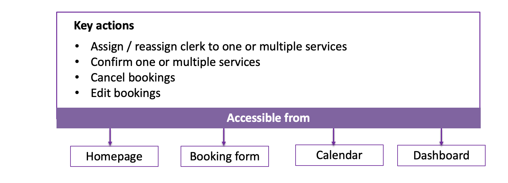

  - ### Homepage 

    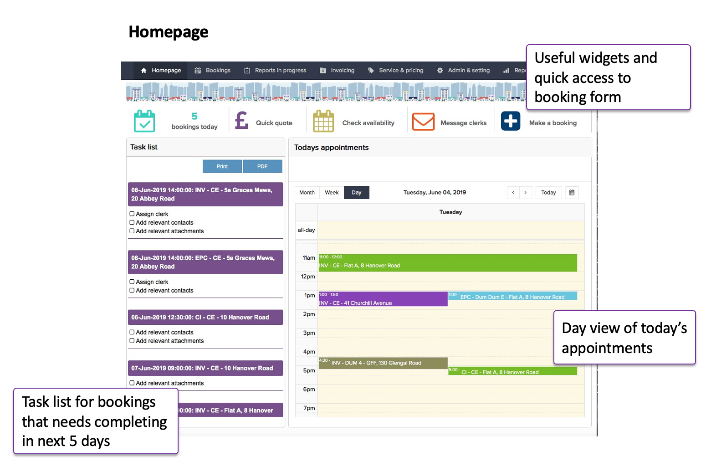
  
  - ### Calendar 

    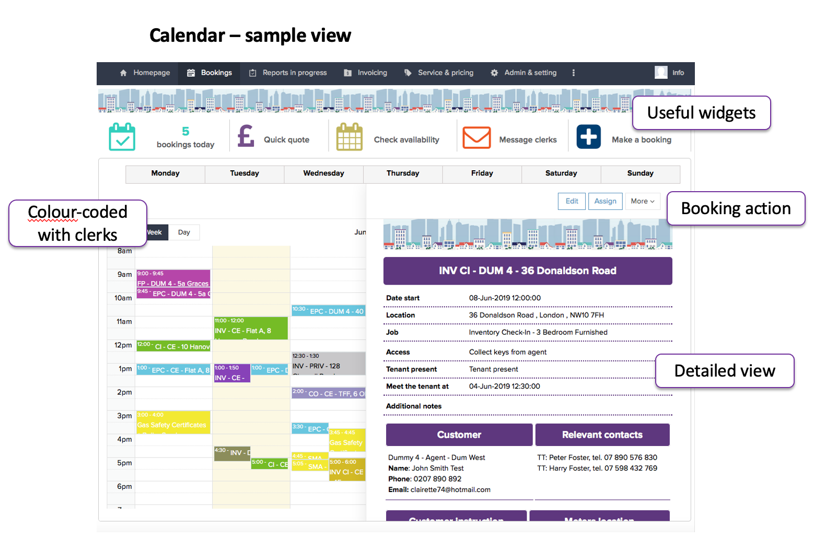

  - ### Dashboard 

    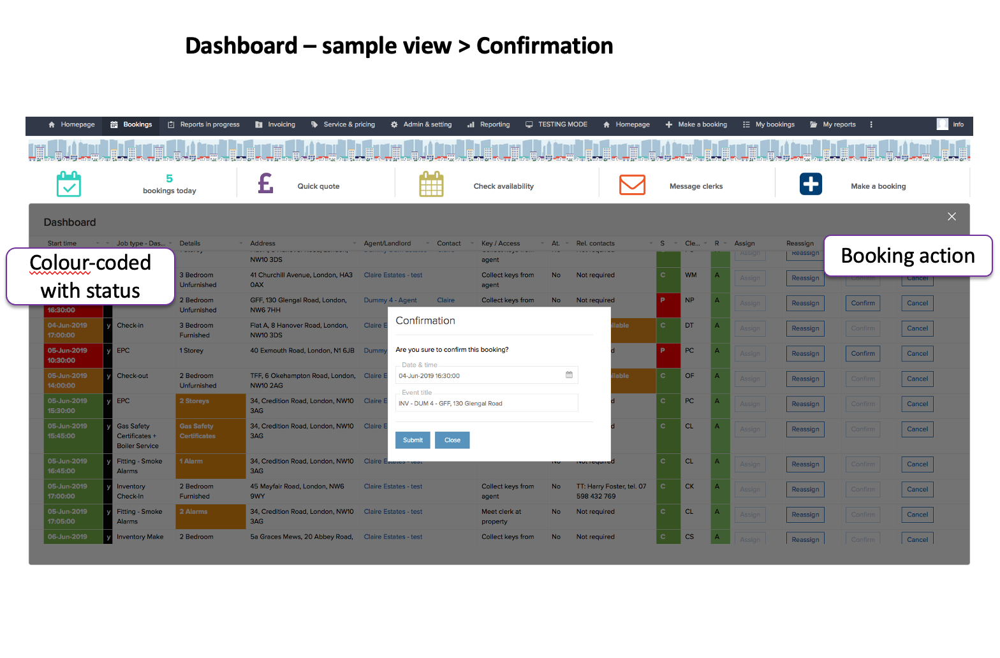

  - ### Assign / Reassign clerks  

    - #### Assign clerks 

      - Automated “new appointment” email to clerks with a link to accept / decline appointments & a booking summary.
      - Appointments will display in clerk portal in both their dashboard and calendar 
      - Automated notification to Papoose Property Services up acceptation/declination appointment
      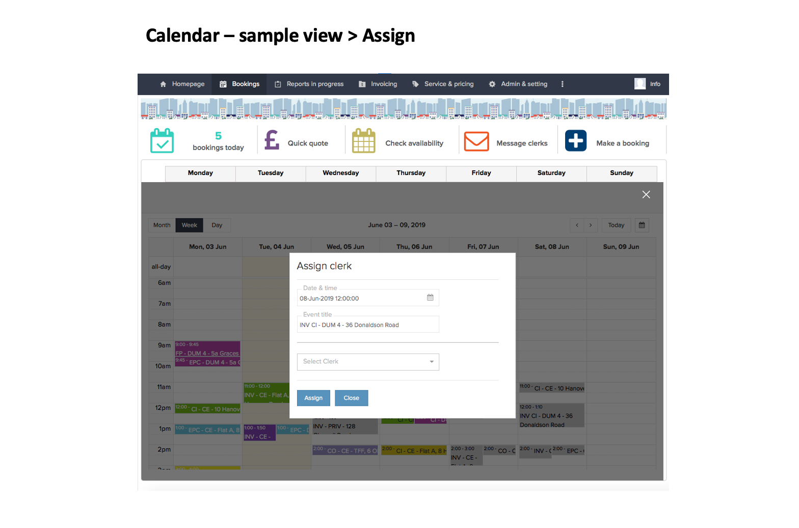
    - #### Reassign clerks 

      - Automated “new appointment” email to new clerks
      - Automated cancellation email to previous clerk (unless invitation was declined)

  - ### Confirmation 

    - Automated confirmation email to customers (and other contacts as per instructions in booking form)
    - Update booking status across the platform 
    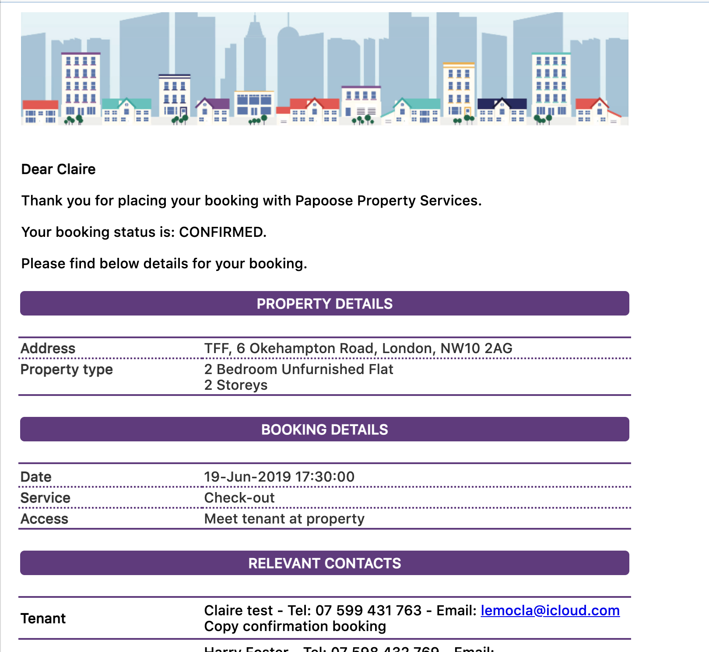
  - ### Cancellation 

    - Automated cancellation email to customers
    - Automated cancellation email to clerks
    - Possibility to add cancellation charge and automated update order / invoice
    - Update booking status across the platform 

  - ### Taskboard 

    - Manage tasks such as review, upload, send reports
    - Create invoice and credit note
    - Upload reports using link with google drive
    - Automated email to customers sending reports  
    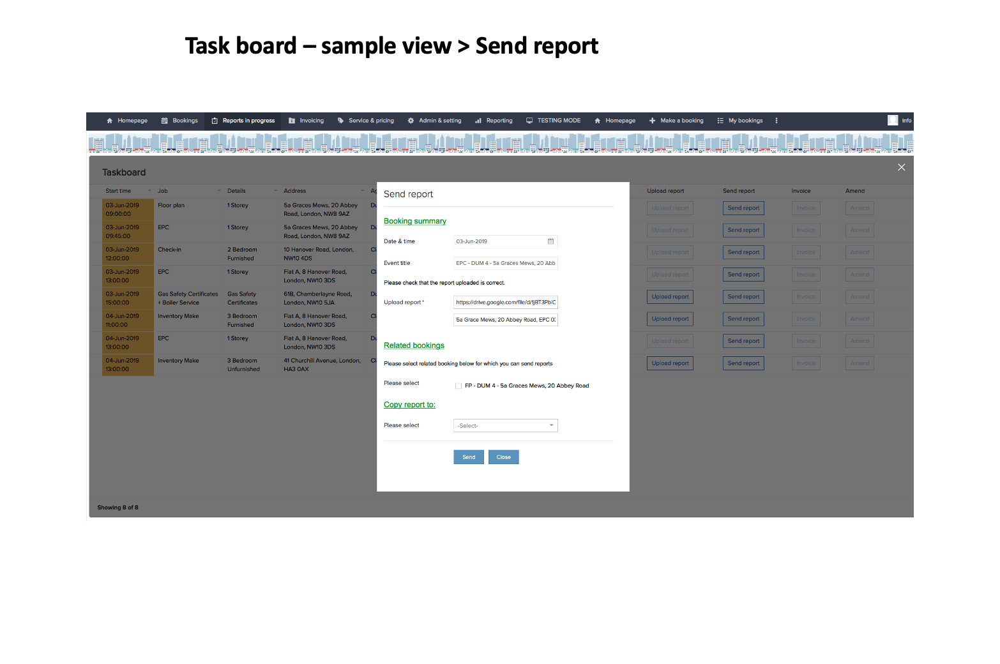
  - ### Invoicing integrated with Zoho Books

    - Update / edit order details and add promotional code
    - Integrated with Zoho Books 
    - Invoice will be sent and created from Zoho Books, with automated email
    - Bookings will be updated with invoice number

## Manage catalogue and price lists

  - ### Catalogue 

    - Create and edit items with price and duration according to job type parameters
    - Fully integrated with Zoho books
    - Schedule price changes
    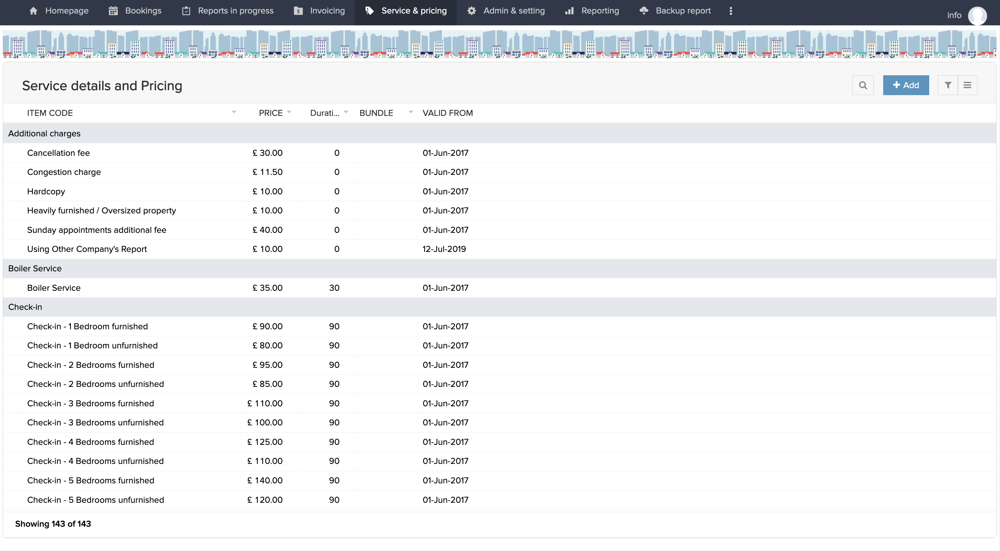
  - ### Price list customer 

    - Create and assign bespoke price list to customer based on main catalogue
    - Price will be reflected in bookings
    - Schedule for price changes
    - Print / download user friendly price list

  - ### Price list clerks 

    - Create and assign bespoke price list to clerks based on main catalogue
    - Clerk rates will be reflected in booking for costing and audit purpose
    - Schedule for price changes
    - Print / download user friendly price list
    - Accessible from the portal
    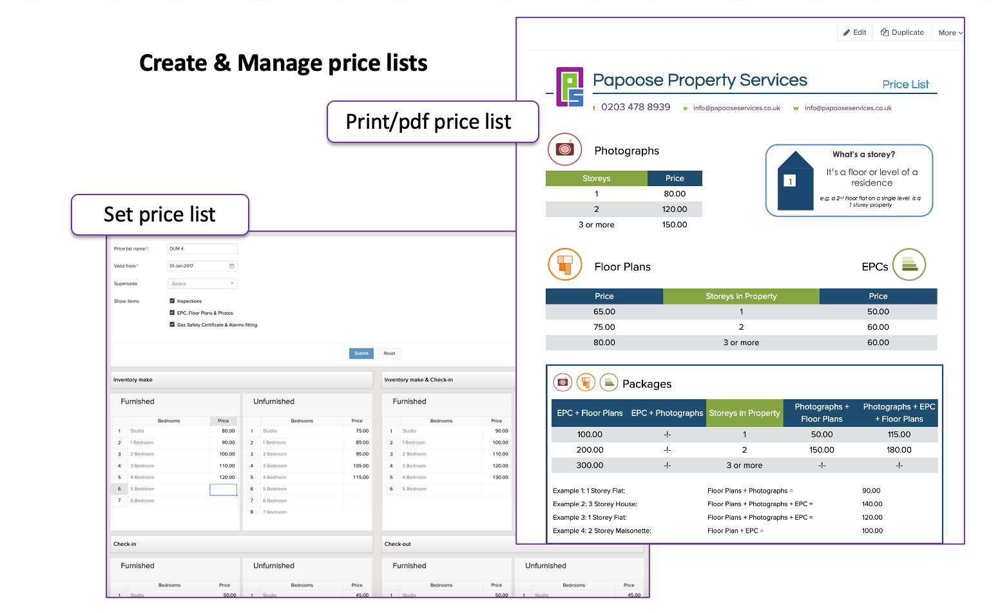

## Parameters 

  - ### Introduction 
    - Add/edit/delete items for each type of parameters
    - Presented in list reports

      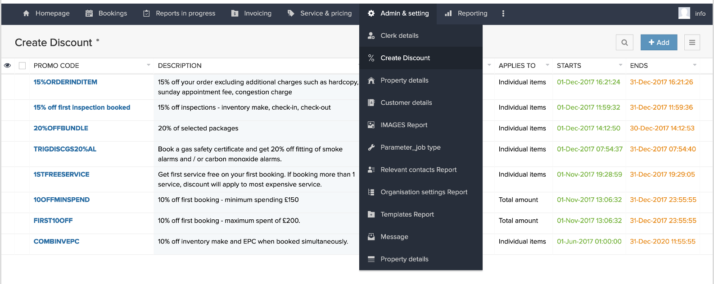

  - ### Clerk details 

    - To add/edit/ delete clerks
    - Set clerks parameter such as jobs they can be assigned to 
    - Assign price list clerk
    - Assign portal users
  
  - ### Customer details 

    - To add/edit/delete customers
    - Integrated with Zoho Books 
    - Set parameters such as default invoice & reports templates 
    - Include customer instructions 
    - Include contact details for customer branch, also integrated with zoho books

  - ### Property details 

    - Add/edit/ delete properties
    - Set property parameters (to be reflected in bookings) such as property size, furnishing, storeys …
    - Additional information on gas & electricity meters

  - ### Template report 

    - Add/edit/delete templates for inspection reports
    - Accessible from the clerk portal
  
  - ### Created discount

    - Add/edit/ delete promotional code
    - Set promotion according to period of times and selected products
    - Can be applied in % or GBP to the order details

 - ### Job type

    - Add/edit main job categories 
    - Set price list type such as property size, surface or flat fee – to define the configuration of products in the catalogue
    - Can be set as active/inactive on different platform such as website / portal
    - Can be set as backend for add-ons

- ### Messages

  - Add/edit/delete message to be shown on portal
  - Automated email to clerks according to validity and frequency

## Reporting 

  - Visualization of the activity
  - Booking report and satus
  - Clerk report and costs

  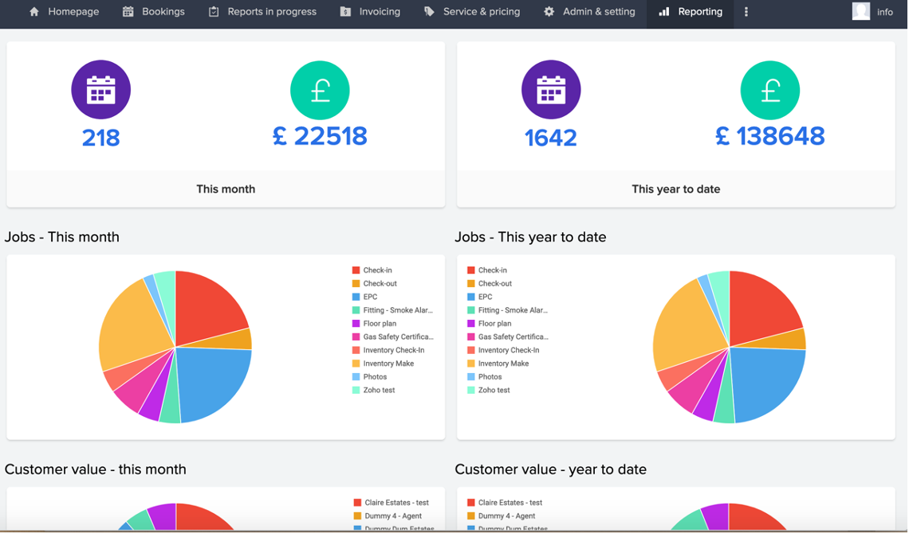

## Clerk portal

  - Homepage
  - View my calendar
  - View my dashboard
  - Set availability
  - View my rates 
  - View templates

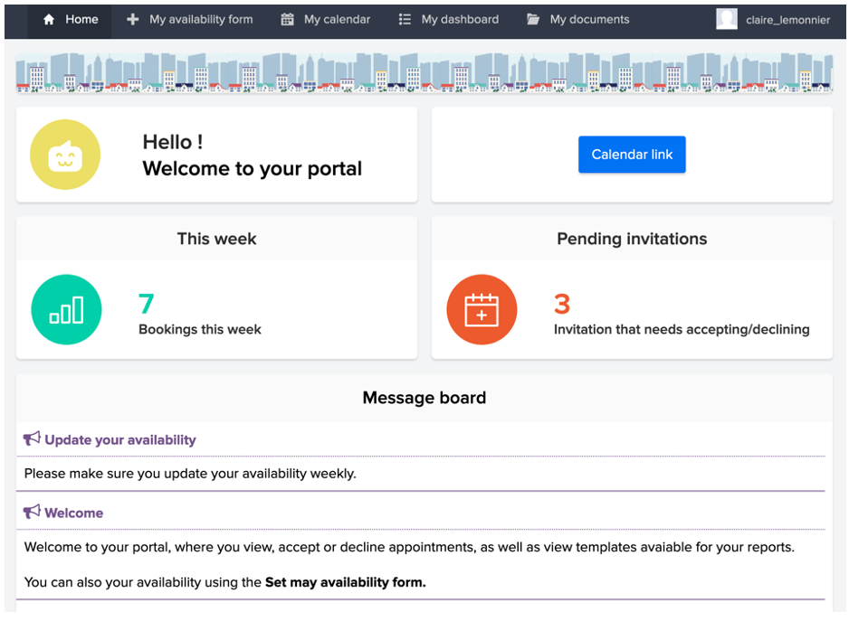

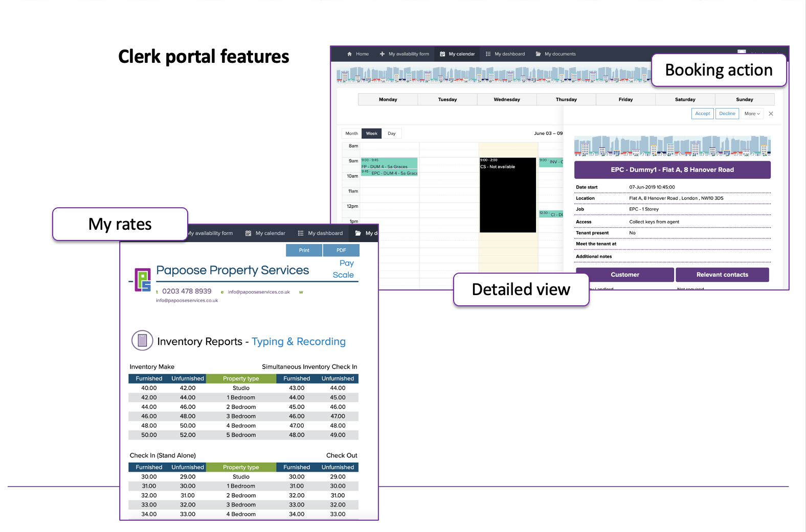
